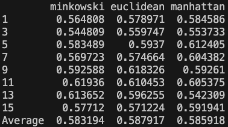

# Vowel Classifier

Saul Vassallo 88812L

## Feature Extraction

The chosen words were:

- heed, hid, had

The vowel phenomes ended up as follows:

- IY, IH, AE

### FTT analysis

In order to select the vowel the process followed is depicted below through screenshots. It involves selecting the word, then selecting the vowel, then doing formant analysis on the vowel.

A segment like this was selected for vowel extraction:

The first formant was selected as the dominant peak identified between the ranges of 300hz to 900hz.

The second formant was identified as the dominant peak within the ranges 900hz to 2500hz.

The 3rd formant was identified as the first dominant peak within the ranges 2500hz+.

These can be viewed on the image as the 3 black arrows. The red arrow indicates a peak that occured too early to be considered a formant so it was ignored.

Sometimes there werent prominent peaks present, rather a few peaks within a region. In this case I opted to take the average of the peaks as my formant.

## Classifier

The code for this section of the project can be run from the _main.py_ file. The functions developed for this part of the project can be found in _functions.py_.

In this section, k was set to 5 as default and each section was run 10 times randomly.

### Q1 - Different K-Values

A function was developed to obtain the average f1 score for the following k-values:

These results show us that more is not necessarily better in terms of nearest neighbours. Although there was a slight difference, it was almost negligible in some cases.

### Q2 - Distance Metrics

I tested the _minowski_, _euclidean_ and _manhattan_ distance metrics on varying k-values.

Below are my results:

The different distance metrics do make a difference, however, the difference is almost negligible on average. It was also noted that the best value seen was a combination of k = 7 and using minowski distance.

### Q3 - Gender Differences

This section was not tackled due to time constraints.

### Q4 - Most Confusing Phenomes

The confusion matrix below was used to determine which phenomes were the most confusing for the model.

From these results it can clearly be seen that _IY_ was the most confusing phenome, getting misclassified 44% of the time.
