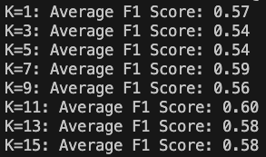
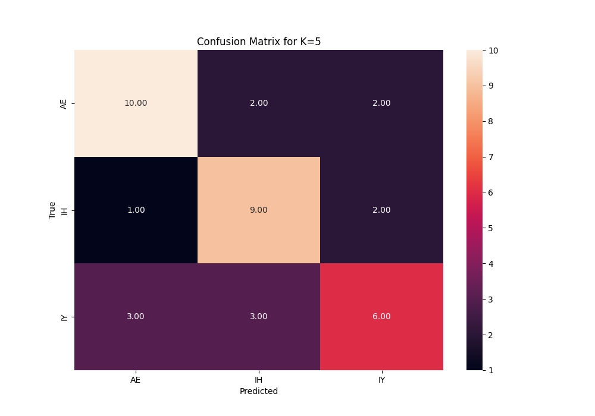

# Vowel Classifier

Saul Vassallo 88812L

## Feature Extraction

The chosen words were:

- x
- y
- z

The vowel phenomes ended up as follows:

- x
- y
- z

A segment like this was selected for vowel extraction:

### FTT analysis

## Classifier

The code for this section of the project can be run from the _main.py_ file. The functions developed for this part of the project can be found in _functions.py_.

In this section, k was set to 5 as default and each section was run 10 times randomly.

### Q1 - Different K-Values

A function was developed to obtain the average f1 score for the following k-values:

These results show us that more is not necessarily better in terms of nearest neighbours. Although there was a slight difference, it was almost negligible in some cases.

### Q2 - Distance Metrics

I tested the _minowski_, _euclidean_ and _manhattan_ distance metrics on varying k-values.

Below are my results:

The different distance metrics do make a difference, however, the difference is almost negligable on average. Manhattan was observed to perform the best on the most accurate k-value levels.

### Q3 - Gender Differences

This section waas not tackled due to time constraints

### Q4 - Most Confusing Phenomes

The confusion matrix below was used to determine which phenomes were the most confusing for the model.

From these results it can clearly be seen that _IY_ was the most confusing phenome, getting misclassified 44% of the time.
